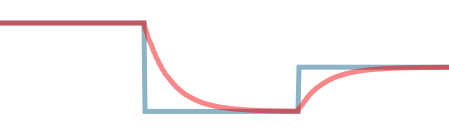

# Filters

```lua
local filters = require "crit.filters"
```

Small module that implements low-pass and high-pass filters. Useful in animation
for smoothing out a signal (low-pass) or for focusing on fast changes in the
signal (high-pass).

## Low-pass filters



[Low-pass filters] remove high frequencies from a signal, which effectively smoothens it out.
This makes them useful, for example, for smoothly animating a value towards a rapidly changing target
value without having to continuously cancel and
re-start animations or worry about fixed animation
durations.

[Low-pass filters]: https://en.wikipedia.org/wiki/Low-pass_filter

### Usage

```lua
local filter = filters.low_pass(cutoff_frequency)
output = filter(previous_output, input, dt)
```

**Example:**

```lua
-- Creating a low-pass filter with 1Hz cutoff,
-- meaning the signal will almost completely
-- smoothen out in roughly 1s
local filter = filters.low_pass(1.0)

function init(self)
  self.target = 0.0
  self.filtered_value = 0.0
end

function on_input(self, action_id, action)
  if action_id == hash("gamepad_lstick_right") then
    self.target = action.value
  end
end

function update(self, dt)
  self.filtered_value = filter(
    self.filtered_value,
    self.target,
    dt
  )
end
```

> TODO