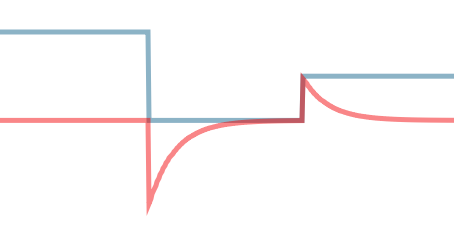

# Filters

```lua
local filters = require "crit.filters"
```

Small module that implements low-pass and high-pass filters. Useful in animation
for smoothing out a signal (low-pass) or for focusing on fast changes in the
signal (high-pass).

**Usage example:** [examples/filters/filters.script](../examples/filters/filters.script)

## Low-pass filters


[Low-pass filters] remove high frequencies from a signal, which effectively smoothens it out.
This makes them useful, for example, for smoothly animating a value towards a rapidly changing target
value without having to continuously cancel and
re-start animations or worry about fixed animation
durations.

[Low-pass filters]: https://en.wikipedia.org/wiki/Low-pass_filter

### API

```lua
local filter = filters.low_pass(cutoff_frequency)
output = filter(previous_output, input, dt)
```

* `previous_output`: `number | vector3 | vector4` The previous output value of the filter
* `input`: `number | vector3 | vector4` The current value of the input signal
* `dt`: `number` Elapsed time (in seconds) since the previous sample
* `output`: `number | vector3 | vector4` The current output value of the filter

## High pass filters



[High-pass filters] remove low frequencies from a signal, leaving out only the
high frequencies. This is useful for situations where you need to track
abrupt momentary changes.

[High-pass filters]: https://en.wikipedia.org/wiki/High-pass_filter

### API

```lua
local filter = filters.high_pass(cutoff_frequency)
output = filter(previous_output, delta_input, dt)
```

* `previous_output`: `number | vector3 | vector4` The previous output value of the filter
* `delta_input`: `number | vector3 | vector4` The difference between the current and previous values of the input signal
* `dt`: `number` Elapsed time (in seconds) since the previous sample
* `output`: `number | vector3 | vector4` The current output value of the filter
